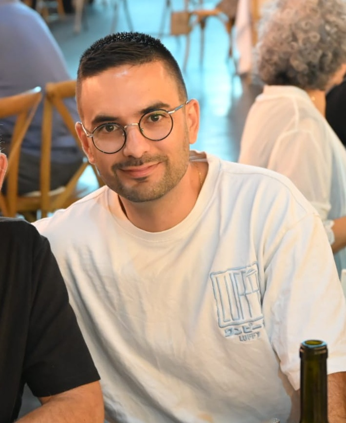

# אודות שעה של שקט

{ width="180" style="border-radius: 12px; display: block; margin: 0 auto;" }

## קצת עליי 👨‍👩‍👧‍👦

שמי דולב, אני מהנדס תוכנה בן 34, בעל ואבא לשלושה ילדים:  
לביא - בן 5  
אן - בת 3  
עידו - בן שנה  

בגלל זה תמצאו כאן המלצות בעיקר לגילאים האלה - כי זו החוויה שלי, וזה הניסיון שיש לי.

## למה הקמתי את האתר הזה? 🎯

כשהילד הראשון שלי נולד, הייתי בטוח שתוכנית טלוויזיה מסוימת (ששמה מתחרז עם "שוקו לימון") מעולה לילדים. ואז נתקלתי ברשת בהסברים למה זה בעצם ממכר מידי, צבעוני מידי, קופצני מידי, ופחות מומלץ לילדים.

ככל שהזמן עבר המשכתי לקבל דעות סותרות כמעט על כל דבר טאבלטים, טלפונים, משחקי מחשב, ספרים וסרטים. **הבנתי שאני צריך מחקר והמלצות אמיתיות מהורים אחרים כדי להבין מה טוב, מה פחות, ומה פשוט רע לחלוטין.**

## הרעיון �

**שעה של שקט** הוא מקום שבו הורים חולקים עם הורים. בלי מרקטינג, בלי שטויות - רק חוויות אמיתיות והמלצות מבוססות מחקרים.

כל המידע כאן זמין בחינם לכולם, כי ידע איכותי על חינוך ילדים צריך להיות נגיש.

## רוצים לתרום? 🤝

[שתפו את ההמלצות שלכם](contribute.md){ .md-button .md-button--primary }

---

## בואו נתחבר 🌐

[:fontawesome-brands-linkedin: LinkedIn](https://www.linkedin.com/in/dolev-ben-aharon/){ .md-button target="_blank" }
[:fontawesome-brands-x-twitter: X / Twitter](https://x.com/_dolby360){ .md-button target="_blank" }
[:fontawesome-brands-github: GitHub](https://github.com/dolby360){ .md-button target="_blank" }
[:fontawesome-solid-envelope: Email](mailto:dolevben054@gmail.com){ .md-button }

---

**שעה של שקט** - כי ביחד אנחנו יותר חכמים 💝